# Title With Slug — Permalink Field for Filament v5

[](https://packagist.org/packages/blendbyte/filament-title-with-slug)
[](https://packagist.org/packages/blendbyte/filament-title-with-slug)
[](https://github.com/blendbyte/filament-title-with-slug/actions/workflows/run-tests.yml)
[](https://github.com/blendbyte/filament-title-with-slug/actions/workflows/static-analysis.yml)
[](https://packagist.org/packages/blendbyte/filament-title-with-slug)
[](LICENSE.md)

Title + slug field for Filament v5 with auto-slug generation, live permalink preview, and inline editing.

```php
use Blendbyte\FilamentTitleWithSlug\TitleWithSlugInput;

TitleWithSlugInput::make()
```

[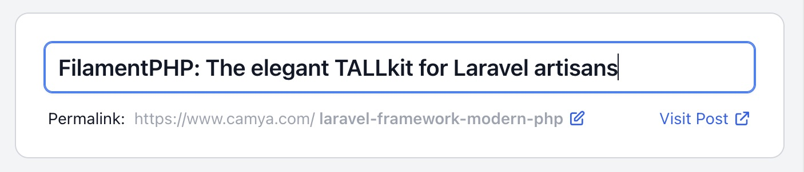](docs/examples/camya-filament-title-with-slug_example_change-fields_01.jpg)

[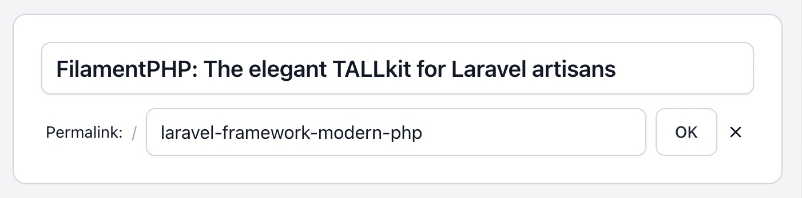](docs/examples/camya-filament-title-with-slug_example_change-fields_02.jpg)

## Requirements

| Package (blendbyte) | Filament | PHP | Laravel | Namespace |
|---|---|---|---|---|
| `^3.x` | `^5.0` | `^8.2` – `^8.5` | `^11` / `^12` / `^13`* | `Blendbyte\FilamentTitleWithSlug` |
| `^2.x` | `^4.0` | `^8.2` | `^11` / `^12` | `Camya\Filament\Forms\Components` |
| `^1.x` | `^3.0` | `^8.1` | `^10` / `^11` / `^12` | `Camya\Filament\Forms\Components` |

> *PHP 8.2 is not tested against Laravel 13.

Looking for Filament v2 support? The original package is at [camya/filament-title-with-slug](https://github.com/camya/filament-title-with-slug).

## Features

- Auto-generates a URL-safe slug from the title
- Live permalink preview (`https://example.com/blog/my-post`)
- Inline slug editing with OK / Cancel / Reset
- "Visit" link to the published URL
- Readonly mode for title and/or slug independently
- Custom title field — pass any Filament field (e.g. a translatable input) as the title
- Fully configurable: labels, placeholder, URL host & path, validation rules, slugifier
- Translatable UI strings (7 languages included)
- Dark mode supported
- No Tailwind build step required

## Table of Contents

- [Upgrading](#upgrading)
- [Installation](#installation)
- [Translation](#translation)
- [Usage & Examples](#usage--examples)
  - [Basic usage](#basic-usage)
  - [Custom title field](#custom-title-field)
  - [Change model field names](#change-model-field-names)
  - [Change labels and placeholder](#change-labels-and-placeholder)
  - [Permalink preview: hide host](#permalink-preview-hide-host)
  - [Permalink preview: change host and path](#permalink-preview-change-host-and-path)
  - [Visit link via named route](#visit-link-via-named-route)
  - [Hide the Visit link](#hide-the-visit-link)
  - [Style the title input](#style-the-title-input)
  - [Readonly title or slug](#readonly-title-or-slug)
  - [Validation rules](#validation-rules)
  - [Custom unique validation](#custom-unique-validation)
  - [Custom error messages](#custom-error-messages)
  - [Custom slugifier](#custom-slugifier)
  - [Dark mode](#dark-mode)
  - [Empty homepage slug](#empty-homepage-slug)
  - [Within a repeater](#within-a-repeater)
  - [URL slug sandwich](#url-slug-sandwich)
  - [Slug as subdomain](#slug-as-subdomain)
  - [Config file defaults](#config-file-defaults)
  - [All available parameters](#all-available-parameters)
- [Credits](#credits)

## Upgrading

All upgrades to v3.x share one breaking change: **the namespace changed** from `Camya\Filament\Forms\Components` (used in v1 and v2) to `Blendbyte\FilamentTitleWithSlug`.

Find every import of the component in your app and update it:

```php
// Before (v1.x and v2.x)
use Camya\Filament\Forms\Components\TitleWithSlugInput;

// After (v3.x)
use Blendbyte\FilamentTitleWithSlug\TitleWithSlugInput;
```

The `TitleWithSlugInput::make()` call signature and all parameter names are unchanged.

---

### From v2.x (Filament v4 → v5)

```bash
composer require blendbyte/filament-title-with-slug:^3.0
```

1. Update the namespace as shown above.
2. Remove any manual CSS import for this package from your Tailwind config or Vite pipeline — v3 registers its stylesheet automatically via Filament's asset system. No build step required.

New in v3: the [`titleField`](#custom-title-field) parameter for passing a custom field (e.g. translatable) as the title input.

---

### From v1.x (Filament v3 → v5)

```bash
composer require blendbyte/filament-title-with-slug:^3.0
```

1. Update the namespace as shown above.
2. Remove any manual CSS imports (see above).
3. See the [Filament upgrade guide](https://filamentphp.com/docs/upgrade-guide) for app-level Filament changes.

---

### From `camya/filament-title-with-slug` (Filament v2)

**1. Swap the package:**

```bash
composer remove camya/filament-title-with-slug
composer require blendbyte/filament-title-with-slug:^3.0
```

**2. Update the namespace** as shown above.

**3. Re-publish config and translations** if you had published them previously:

```bash
php artisan vendor:publish --tag="filament-title-with-slug-config" --force
php artisan vendor:publish --tag="filament-title-with-slug-translations" --force
```

**4. Remove any manual CSS imports** — v3 registers its stylesheet automatically.

**5.** See the [Filament upgrade guide](https://filamentphp.com/docs/upgrade-guide) for app-level Filament changes.

---

## Installation

```bash
composer require blendbyte/filament-title-with-slug
```

Optionally publish the config file:

```bash
php artisan vendor:publish --tag="filament-title-with-slug-config"
```

## Translation

Publish the translation files:

```bash
php artisan vendor:publish --tag="filament-title-with-slug-translations"
```

Published translations land at `lang/vendor/filament-title-with-slug`.

Included languages: [English](resources/lang/en/package.php), [French](resources/lang/fr/package.php), [Brazilian Portuguese](resources/lang/pt_BR/package.php), [German](resources/lang/de/package.php), [Dutch](resources/lang/nl/package.php), [Indonesian](resources/lang/id/package.php), [Arabic](resources/lang/ar/package.php).

Added a translation? Share it on our [GitHub Discussions](https://github.com/blendbyte/filament-title-with-slug/discussions) page.

## Usage & Examples

### Basic usage

Add `TitleWithSlugInput` to any Filament form schema. It binds to `title` and `slug` by default:

```php
use Blendbyte\FilamentTitleWithSlug\TitleWithSlugInput;

class PostResource extends Resource
{
    public static function form(Form $form): Form
    {
        return $form->schema([

            TitleWithSlugInput::make(),

        ]);
    }
}
```

> **Tip:** Use `->columnSpan('full')` to make the component span the full form width.

### Custom title field

Pass any Filament field as the title input via `titleField`. This is useful when you need a translatable input or another custom field type from a third-party package:

```php
TitleWithSlugInput::make(
    titleField: \Spatie\FilamentTranslatable\Forms\Components\TranslatableInput::make('title'),
)
```

The package automatically wires slug auto-generation onto the provided field. The field name is derived from `getName()`, so you don't need to pass `fieldTitle` separately unless you want to override it.

All title-specific parameters (`titleLabel`, `titleRules`, `titlePlaceholder`, etc.) are **ignored** when `titleField` is provided — configure those directly on your field before passing it in.

The `titleAfterStateUpdated` and `titleFieldWrapper` parameters still work regardless:

```php
TitleWithSlugInput::make(
    titleField: MyTranslatableField::make('title')
        ->label('Post Title')
        ->required(),
    titleAfterStateUpdated: function (Set $set, string $state) {
        // runs after every title update
    },
)
```

### Change model field names

Default field names are `title` and `slug`. Override them:

```php
TitleWithSlugInput::make(
    fieldTitle: 'name',
    fieldSlug: 'identifier',
)
```

### Change labels and placeholder

```php
TitleWithSlugInput::make(
    urlPath: '/book/',
    urlVisitLinkLabel: 'Visit Book',
    titleLabel: 'Title',
    titlePlaceholder: 'Insert the title...',
    slugLabel: 'Link:',
)
```

[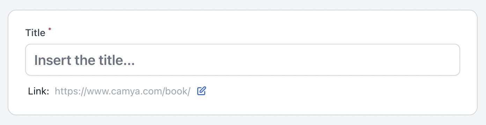](docs/examples/camya-filament-title-with-slug_example_change-labels_01.jpg)

[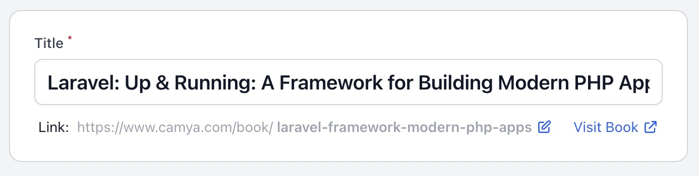](docs/examples/camya-filament-title-with-slug_example_change-labels_02.jpg)

### Permalink preview: hide host

```php
TitleWithSlugInput::make(
    urlHostVisible: false,
)
```

[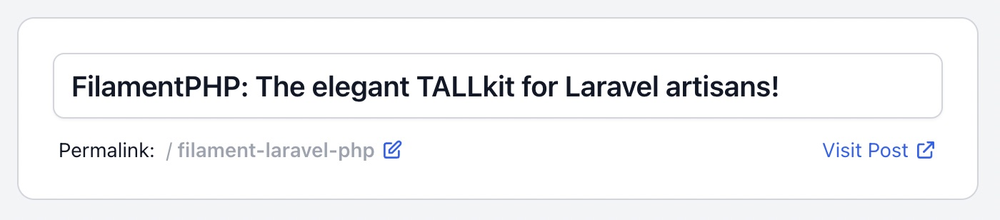](docs/examples/camya-filament-title-with-slug_example_host-hidden_01.jpg)

### Permalink preview: change host and path

```php
TitleWithSlugInput::make(
    urlPath: '/category/',
    urlHost: 'https://project.local',
)
```

[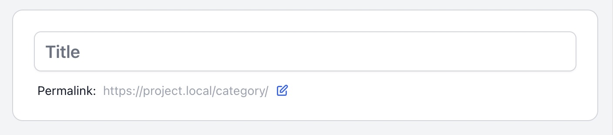](docs/examples/camya-filament-title-with-slug_example_host-change_01.jpg)

### Visit link via named route

Use a named route to generate the Visit link URL:

```php
TitleWithSlugInput::make(
    urlPath: '/product/',
    urlHost: 'camya.com',
    urlVisitLinkRoute: fn(?Model $record) => $record?->slug
        ? route('product.show', ['slug' => $record->slug])
        : null,
)
```

Because the Visit URL is now route-generated, you can use a short `urlHost` just for the permalink preview display.

[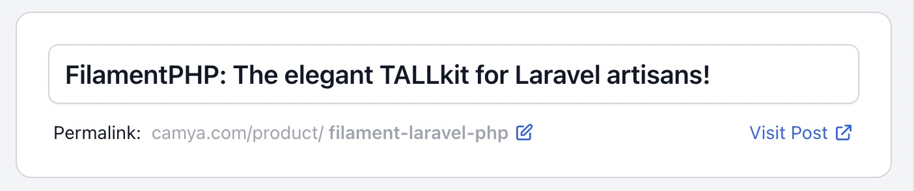](docs/examples/camya-filament-title-with-slug_example_host-partial_01.jpg)

### Hide the Visit link

```php
TitleWithSlugInput::make(
    urlVisitLinkVisible: false,
)
```

### Style the title input

Pass extra HTML attributes directly to the title `<input>` element:

```php
TitleWithSlugInput::make(
    titleExtraInputAttributes: ['class' => 'italic'],
)
```

[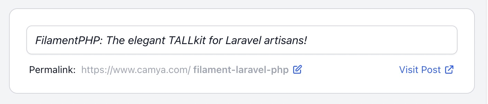](docs/examples/camya-filament-title-with-slug_example_styling_01.jpg)

### Readonly title or slug

Lock either field, optionally based on context:

```php
TitleWithSlugInput::make(
    titleIsReadonly: fn($context) => $context === 'edit',
    slugIsReadonly: fn($context) => $context === 'edit',
)
```

When `slugIsReadonly` is `true` the slug row renders as a static permalink display (no edit link, no action buttons).

### Validation rules

```php
TitleWithSlugInput::make(
    titleRules: [
        'required',
        'string',
        'min:3',
        'max:120',
    ],
)
```

A unique rule is automatically applied to the slug. To customize it, see [Custom unique validation](#custom-unique-validation).

### Custom unique validation

Pass an array of named arguments that map to Filament's `->unique()` method:

```php
TitleWithSlugInput::make(
    slugRuleUniqueParameters: [
        'modifyRuleUsing' => fn(Unique $rule) => $rule->where('is_published', 1),
        'ignorable' => fn(?Model $record) => $record,
    ],
)
```

Available keys: `ignorable`, `modifyRuleUsing`, `ignoreRecord`, `table`, `column`.

### Custom error messages

Override validation messages in your resource class:

```php
protected $messages = [
    'data.slug.regex' => 'Invalid slug. Use only a–z, 0–9, and hyphens.',
];
```

### Custom slugifier

Replace the default `Str::slug()` with your own closure:

```php
TitleWithSlugInput::make(
    slugSlugifier: fn($string) => preg_replace('/[^a-z]/', '', $string),
    slugRuleRegex: '/^[a-z]*$/',
)
```

### Dark mode

[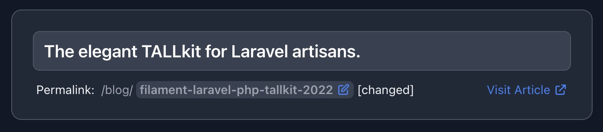](docs/examples/camya-filament-title-with-slug_example_dark-mode_01.jpg)

[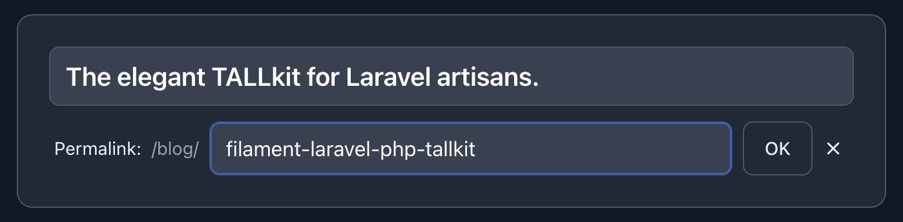](docs/examples/camya-filament-title-with-slug_example_dark-mode_02.jpg)

### Empty homepage slug

Remove the slug's `required` rule, then use `/` as the slug value to represent the homepage. The `/` bypasses the auto-regeneration that would trigger on an empty value:

```php
TitleWithSlugInput::make(
    slugRules: [],
)
```

[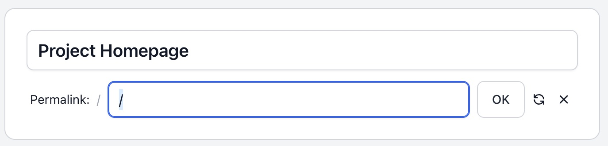](docs/examples/camya-filament-title-with-slug_example_homepage_01.jpg)

### Within a repeater

```php
Repeater::make('FAQEntries')
    ->relationship()
    ->collapsible()
    ->schema([

        TitleWithSlugInput::make(
            fieldTitle: 'title',
            fieldSlug: 'slug',
            urlPath: '/faq/',
            urlHostVisible: false,
            titleLabel: 'Title',
            titlePlaceholder: 'Insert FAQ title...',
        ),

    ]),
```

[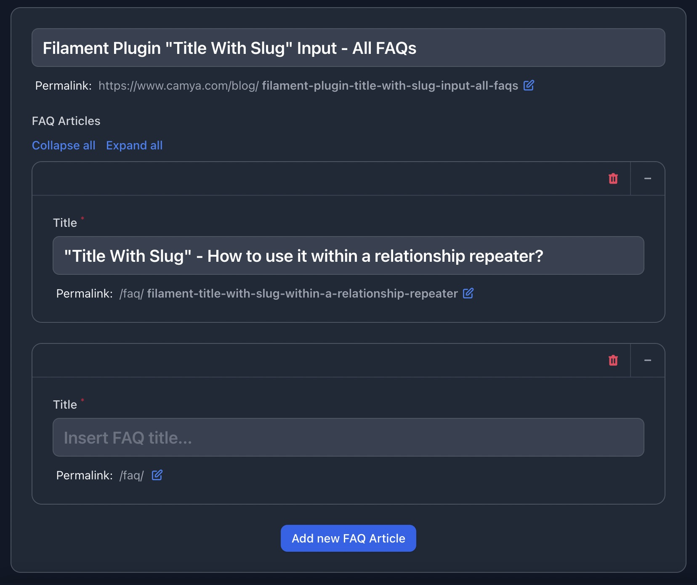](docs/examples/camya-filament-title-with-slug_example_repeater_01.jpg)

### URL slug sandwich

Place the slug in the middle of a path, e.g. `/books/my-slug/detail/`:

```php
TitleWithSlugInput::make(
    urlPath: '/books/',
    urlVisitLinkRoute: fn(?Model $record) => $record?->slug
        ? '/books/' . $record->slug . '/detail'
        : null,
    slugLabelPostfix: '/detail/',
    urlVisitLinkLabel: 'Visit Book Details',
),
```

[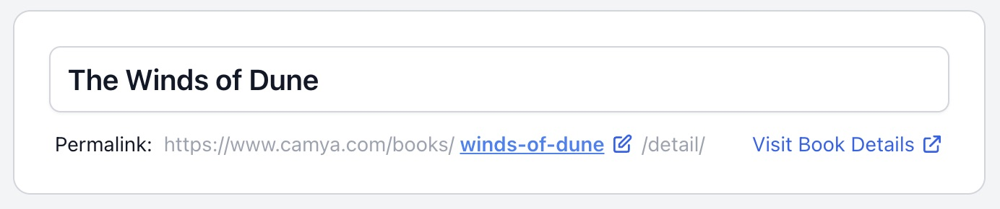](docs/examples/camya-filament-title-with-slug_example_slug-sandwich_01.jpg)

### Slug as subdomain

```php
TitleWithSlugInput::make(
    fieldSlug: 'subdomain',
    urlPath: '',
    urlHostVisible: false,
    urlVisitLinkLabel: 'Visit Domain',
    urlVisitLinkRoute: fn(?Model $record) => $record?->slug
        ? 'https://' . $record->slug . '.camya.com'
        : null,
    slugLabel: 'Domain:',
    slugLabelPostfix: '.camya.com',
),
```

[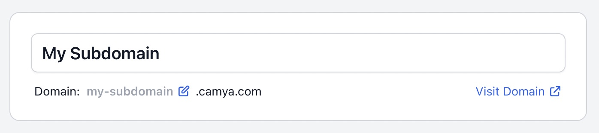](docs/examples/camya-filament-title-with-slug_example_subdomain_01.jpg)

### Config file defaults

Publish the config to set global defaults:

```bash
php artisan vendor:publish --tag="filament-title-with-slug-config"
```

Published at `config/filament-title-with-slug.php`:

```php
[
    'field_title' => 'title',          // Override per-field with fieldTitle:
    'field_slug'  => 'slug',           // Override per-field with fieldSlug:
    'url_host'    => env('APP_URL'),   // Override per-field with urlHost:
]
```

### All available parameters

All parameters are optional and use [named argument](https://www.php.net/manual/en/functions.named-arguments.php) syntax. Parameters marked *(ignored when `titleField` is set)* only apply to the default TextInput.

```php
TitleWithSlugInput::make(

    // Model fields
    fieldTitle: 'title',
    fieldSlug: 'slug',

    // Custom title field — replaces the default TextInput
    titleField: SomeField::make('title'),

    // URL
    urlPath: '/blog/',
    urlHost: 'https://www.example.com',
    urlHostVisible: true,
    urlVisitLinkLabel: 'View',
    urlVisitLinkRoute: fn(?Model $record) => $record?->slug
        ? route('post.show', ['slug' => $record->slug])
        : null,
    urlVisitLinkVisible: true,

    // Title — ignored when titleField is provided
    titleLabel: 'The Title',
    titlePlaceholder: 'Post Title',
    titleExtraInputAttributes: ['class' => 'italic'],
    titleRules: ['required', 'string'],
    titleRuleUniqueParameters: [
        'modifyRuleUsing' => fn(Unique $rule) => $rule->where('is_published', 1),
        'ignorable' => fn(?Model $record) => $record,
    ],
    titleIsReadonly: fn($context) => $context !== 'create',
    titleAutofocus: true,

    // Title callbacks — work with both default TextInput and custom titleField
    titleAfterStateUpdated: function ($state) {},
    titleFieldWrapper: fn($field) => $field,

    // Slug
    slugLabel: 'The Slug:',
    slugRules: ['required', 'string'],
    slugRuleUniqueParameters: [
        'modifyRuleUsing' => fn(Unique $rule) => $rule->where('is_published', 1),
        'ignorable' => fn(?Model $record) => $record,
    ],
    slugIsReadonly: fn($context) => $context !== 'create',
    slugSlugifier: fn($string) => Str::slug($string),
    slugRuleRegex: '/^[a-z0-9\-\_]*$/',
    slugAfterStateUpdated: function ($state) {},
    slugLabelPostfix: '/suffix',

)->columnSpan('full'),
```

## Credits

Originally created by [Andreas Scheibel (camya)](https://github.com/camya). Inspired by packages from [awcodes](https://github.com/awcodes/) and the work of [spatie](https://github.com/spatie/). Tests built with [Pest](https://pestphp.com/).

Please see the [release changelog](https://github.com/blendbyte/filament-title-with-slug/releases) for version history, and [contributing](https://github.com/blendbyte/filament-title-with-slug/blob/main/.github/CONTRIBUTING.md) for how to get involved. Security vulnerabilities can be reported via our [security policy](https://github.com/blendbyte/filament-title-with-slug/security/policy).

## Maintained by Blendbyte

<br>

<p align="center">
  <a href="https://www.blendbyte.com">
    <picture>
      <source media="(prefers-color-scheme: dark)" srcset="https://www.blendbyte.com/logo_horizontal_light.png">
      
    </picture>
  </a>
</p>

<p align="center">
  <strong><a href="https://www.blendbyte.com">Blendbyte</a></strong> builds cloud infrastructure, web apps, and developer tools.<br>
  We've been shipping software to production for 20+ years.
</p>

<p align="center">
  This package runs in our own stack, which is why we keep it maintained.<br>
  Issues and PRs get read. Good ones get merged.
</p>

<br>

<p align="center">
  <a href="https://www.blendbyte.com">blendbyte.com</a> · <a href="mailto:hello@blendbyte.com">hello@blendbyte.com</a>
</p>
