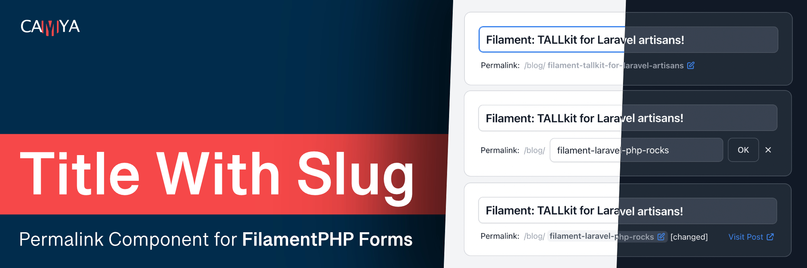

[](docs/camya-filament-title-with-slug_teaser-github.jpg)

# Title With Slug — Easy Permalink Slugs for Filament Forms

[](https://packagist.org/packages/blendbyte/filament-title-with-slug)
[](LICENSE.md)

A [Filament](https://filamentphp.com/) form component that provides a WordPress-style title & slug input. Auto-generates slugs from titles, supports undo, dark mode, custom slugifiers, and is fully configurable and translatable.

Forked from [camya/filament-title-with-slug](https://github.com/camya/filament-title-with-slug), updated for Filament v3.

```php
TitleWithSlugInput::make(
    fieldTitle: 'title',
    fieldSlug: 'slug',
),
```

The output looks like this: (Watch **[» Demo Video «](https://www.youtube.com/watch?v=5u1Nepm2NiI)**)

[](docs/examples/camya-filament-title-with-slug_example_change-fields_01.jpg)

[](docs/examples/camya-filament-title-with-slug_example_change-fields_02.jpg)

## Features

- Slug edit form with permalink preview.
- "Visit" link to view the generated URL.
- Auto-generates the slug from the title, if it has not already been manually updated.
- Undo an edited slug.
- All texts customizable and translatable.
- Dark mode supported.
- Fully configurable, see [all available parameters](#all-available-parameters).

## Table of Contents

- [Installation](#installation)
- [Translation](#translation)
- [Usage & Examples](#usage--examples)
  - [Basic usage](#basic-usage---add-titlewithsluginput-to-a-filament-form)
  - [Change model field names](#change-model-fields-names)
  - [Change labels, titles, placeholder](#change-labels-titles-placeholder)
  - [Permalink preview: Hide host](#permalink-preview-hide-host)
  - [Permalink preview: Change host and path](#permalink-preview-change-host-and-path)
  - ["Visit" link with route()](#visit-link---use-router-to-generate-url-with-route)
  - [Hide "Visit" link](#hide-visit-link)
  - [Style the title input](#style-the-title-input-field)
  - [Extra validation rules](#add-extra-validation-rules-for-title-or-slug)
  - [Custom error messages](#custom-error-messages)
  - [Custom unique validation](#custom-unique-validation-rules-for-title-and-slug)
  - [Custom slugifier](#custom-slugifier)
  - [Dark mode](#dark-mode)
  - [Empty homepage slug](#how-to-set-a-empty-homepage-slug)
  - [Within a relationship repeater](#use-within-a-relationship-repeater)
  - [URL slug sandwich (path/slug/path)](#make-a-url-slug-sandwich-pathslugpath)
  - [Slug as subdomain](#use-the-slug-as-subdomain)
  - [Config file defaults](#package-config-file---set-default-values)
  - [All available parameters](#all-available-parameters)
- [Credits](#credits)

## Installation

```bash
composer require blendbyte/filament-title-with-slug
```

Optionally publish the config file:

```bash
php artisan vendor:publish --tag="filament-title-with-slug-config"
```

## Translation

Publish the translation files:

```bash
php artisan vendor:publish --tag="filament-title-with-slug-translations"
```

Published translations are located at `trans/vendor/filament-title-with-slug`.

Included translations: [English](resources/lang/en/package.php), [French](resources/lang/fr/package.php), [Brazilian Portuguese](resources/lang/pt_BR/package.php), [German](resources/lang/de/package.php), [Dutch](resources/lang/nl/package.php), [Indonesian](resources/lang/id/package.php), [Arabic](resources/lang/ar/package.php).

Translated it to another language? Share it on our [GitHub Discussions](https://github.com/blendbyte/filament-title-with-slug/discussions) page.

## Usage & Examples

### Basic usage - Add TitleWithSlugInput to a Filament Form

This package provides the custom input field `TitleWithSlugInput` for the [Filament Form Builder](https://filamentphp.com/docs/3.x/admin/installation).

```php
use Camya\Filament\Forms\Components\TitleWithSlugInput;

class PostResource extends Resource
{
    public static function form(Form $form): Form
    {
        return $form->schema([

            TitleWithSlugInput::make(
                fieldTitle: 'title',
                fieldSlug: 'slug',
            )

        ]);
    }
}
```

> **Tip:** To occupy the full width, use `TitleWithSlugInput::make()->columnSpan('full')`.

### Change model fields names

The package assumes your model fields are named `title` and `slug`. You can change them:

```php
TitleWithSlugInput::make(
    fieldTitle: 'name',
    fieldSlug: 'identifier',
)
```

### Change labels, titles, placeholder

All labels can be changed on the fly. In this example, we also add the base path `/books/`:

```php
TitleWithSlugInput::make(
    urlPath: '/book/',
    urlVisitLinkLabel: 'Visit Book',
    titleLabel: 'Title',
    titlePlaceholder: 'Insert the title...',
    slugLabel: 'Link:',
)
```

[](docs/examples/camya-filament-title-with-slug_example_change-labels_01.jpg)

[](docs/examples/camya-filament-title-with-slug_example_change-labels_02.jpg)

### Permalink preview: Hide host

```php
TitleWithSlugInput::make(
    urlHostVisible: false,
)
```

[](docs/examples/camya-filament-title-with-slug_example_host-hidden_01.jpg)

### Permalink preview: Change host and path

```php
TitleWithSlugInput::make(
    urlPath: '/category/',
    urlHost: 'https://project.local',
)
```

[](docs/examples/camya-filament-title-with-slug_example_host-change_01.jpg)

### "Visit" link - Use router to generate URL with route()

Use a named route to generate the "Visit" link:

```php
TitleWithSlugInput::make(
    urlPath: '/product/',
    urlHost: 'camya.com',
    urlVisitLinkRoute: fn(?Model $record) => $record?->slug
        ? route('product.show', ['slug' => $record->slug])
        : null,
)
```

Because the "Visit" link is now generated by a route, you can use partial hosts like `urlHost: 'camya.com'` to shorten the permalink preview.

[](docs/examples/camya-filament-title-with-slug_example_host-partial_01.jpg)

### Hide "Visit" link

```php
TitleWithSlugInput::make(
    urlVisitLinkVisible: false,
)
```

### Style the "title" input field

Pass attributes via `titleExtraInputAttributes`:

```php
TitleWithSlugInput::make(
    titleExtraInputAttributes: ['class' => 'italic'],
)
```

[](docs/examples/camya-filament-title-with-slug_example_styling_01.jpg)

### Add extra validation rules for title or slug

Pass additional validation rules via `titleRules` or `slugRules`. A unique validation rule is applied to the slug field automatically — to modify it, see [Custom unique validation](#custom-unique-validation-rules-for-title-and-slug).

```php
TitleWithSlugInput::make(
    titleRules: [
        'required',
        'string',
        'min:3',
        'max:12',
    ],
)
```

### Custom error messages

Customize error messages in your EditModel and CreateModel Filament resources:

```php
protected $messages = [
    'data.slug.regex' => 'Invalid Slug. Use only chars (a-z), numbers (0-9), and the dash (-).',
];
```

### Custom unique validation rules for title (and slug)

Unique validation rules can be modified via `titleRuleUniqueParameters` and `slugRuleUniqueParameters`:

```php
TitleWithSlugInput::make(
    titleRuleUniqueParameters: [
        'modifyRuleUsing' => fn(Unique $rule) => $rule->where('is_published', 1),
        'ignorable' => fn(?Model $record) => $record,
    ],
)
```

This array is inserted into the input field's `->unique(...[$slugRuleUniqueParameters])` method. See Filament's documentation on the [Unique](https://filamentphp.com/docs/2.x/forms/validation#unique) rule.

Available array keys: `ignorable` (Model | Closure), `modifyRuleUsing` (?Closure), `ignoreRecord` (bool), `table` (string | Closure | null), `column` (string | Closure | null).

### Custom slugifier

This package uses `Str::slug()` by default. You can replace it with your own:

```php
TitleWithSlugInput::make(
    slugSlugifier: fn($string) => preg_replace('/[^a-z]/', '', $string),
    slugRuleRegex: '/^[a-z]*$/',
)
```

### Dark Mode

The package supports [Filament's dark mode](https://filamentphp.com/docs/2.x/admin/appearance#dark-mode):

[](docs/examples/camya-filament-title-with-slug_example_dark-mode_01.jpg)

[](docs/examples/camya-filament-title-with-slug_example_dark-mode_02.jpg)

### How to set a empty homepage slug

First remove the slug's `required` rule by overwriting `slugRules`:

```php
TitleWithSlugInput::make(
    slugRules: [],
),
```

Then use the `/` character in the slug input to set the homepage. The `/` is necessary to bypass the auto slug-regenerate that would trigger on an empty string.

[](docs/examples/camya-filament-title-with-slug_example_homepage_01.jpg)

### Use within a relationship repeater

You can use `TitleWithSlugInput` inside a repeater with a database relation (e.g. "Post hasMany FAQEntries"):

```php
Repeater::make('FAQEntries')
    ->relationship()
    ->collapsible()
    ->schema([

        TitleWithSlugInput::make(
            fieldTitle: 'title',
            fieldSlug: 'slug',
            urlPath: '/faq/',
            urlHostVisible: false,
            titleLabel: 'Title',
            titlePlaceholder: 'Insert FAQ title...'
        )

    ]),
```

[](docs/examples/camya-filament-title-with-slug_example_repeater_01.jpg)

### Make a URL slug sandwich (path/slug/path)

Create a URL with the slug in the middle of the path, e.g. `/books/slug/detail/`:

```php
TitleWithSlugInput::make(
    urlPath: '/books/',
    urlVisitLinkRoute: fn(?Model $record) => $record?->slug
        ? '/books/' . $record->slug . '/detail'
        : null,
    slugLabelPostfix: '/detail/',
    urlVisitLinkLabel: 'Visit Book Details'
),
```

[](docs/examples/camya-filament-title-with-slug_example_slug-sandwich_01.jpg)

### Use the slug as subdomain

Use the package to generate subdomain URLs, e.g. `https://my-subdomain.camya.com`:

```php
TitleWithSlugInput::make(
    fieldSlug: 'subdomain',
    urlPath: '',
    urlHostVisible: false,
    urlVisitLinkLabel: 'Visit Domain',
    urlVisitLinkRoute: fn(?Model $record) => $record?->slug
        ? 'https://' . $record->slug . '.camya.com'
        : null,
    slugLabel: 'Domain:',
    slugLabelPostfix: '.camya.com',
),
```

[](docs/examples/camya-filament-title-with-slug_example_subdomain_01.jpg)

### Package config file - Set default values

If you have different defaults, publish the config and change them globally:

```bash
php artisan vendor:publish --tag="filament-title-with-slug-config"
```

The published config is at `config/filament-title-with-slug-config.php`:

```php
[
    'field_title' => 'title', // Override with (fieldTitle: 'title')
    'field_slug' => 'slug',   // Override with (fieldSlug: 'slug')
    'url_host' => env('APP_URL'), // Override with (urlHost: 'https://www.example.com/')
];
```

### All available parameters

You can call `TitleWithSlugInput` without parameters and it will use its defaults. Parameters use [PHP 8 Named Arguments](https://laravel-news.com/modern-php-features-explained) syntax.

```php
TitleWithSlugInput::make(

    // Model fields
    fieldTitle: 'title',
    fieldSlug: 'slug',

    // URL
    urlPath: '/blog/',
    urlHost: 'https://www.camya.com',
    urlHostVisible: true,
    urlVisitLinkLabel: 'View',
    urlVisitLinkRoute: fn(?Model $record) => $record?->slug
        ? route('post.show', ['slug' => $record->slug])
        : null,
    urlVisitLinkVisible: true,

    // Title
    titleLabel: 'The Title',
    titlePlaceholder: 'Post Title',
    titleExtraInputAttributes: ['class' => 'italic'],
    titleRules: [
        'required',
        'string',
    ],
    titleRuleUniqueParameters: [
        'modifyRuleUsing' => fn(Unique $rule) => $rule->where('is_published', 1),
        'ignorable' => fn(?Model $record) => $record,
    ],
    titleIsReadonly: fn($context) => $context !== 'create',
    titleAutofocus: true,
    titleAfterStateUpdated: function ($state) {},
    titleFieldWrapper: function ($input) { return $input; },

    // Slug
    slugLabel: 'The Slug: ',
    slugRules: [
        'required',
        'string',
    ],
    slugRuleUniqueParameters: [
        'modifyRuleUsing' => fn(Unique $rule) => $rule->where('is_published', 1),
        'ignorable' => fn(?Model $record) => $record,
    ],
    slugIsReadonly: fn($context) => $context !== 'create',
    slugSlugifier: fn($string) => Str::slug($string),
    slugRuleRegex: '/^[a-z0-9\-\_]*$/',
    slugAfterStateUpdated: function ($state) {},
    slugLabelPostfix: null,

)->columnSpan('full'),
```

## Credits

Originally created by [Andreas Scheibel (camya)](https://github.com/camya). Inspired by packages from [awcodes](https://github.com/awcodes/) and the work of [spatie](https://github.com/spatie/). Tests built with [Pest](https://pestphp.com/) following patterns from [ralphjsmit](https://github.com/ralphjsmit/).

Please see the [release changelog](https://github.com/blendbyte/filament-title-with-slug/releases) for version history, and [contributing](https://github.com/blendbyte/filament-title-with-slug/blob/main/.github/CONTRIBUTING.md) for how to get involved. Security vulnerabilities can be reported via our [security policy](https://github.com/blendbyte/filament-title-with-slug/security/policy).

---

## Maintained by Blendbyte

<a href="https://www.blendbyte.com">
  
</a>

This project is maintained by **[Blendbyte](https://www.blendbyte.com)** — a team of engineers with 20+ years of experience building cloud infrastructure, web applications, and developer tools. We use these packages in production ourselves and actively contribute to the open source ecosystem we rely on every day. Issues and PRs are always welcome.

🌐 [blendbyte.com](https://www.blendbyte.com) · 📧 [hello@blendbyte.com](mailto:hello@blendbyte.com)

<br clear="left">
